<div align="center">

# SpeechCoach.AI

### AI-Powered English Pronunciation Training System

**Helping non-native speakers master English pronunciation through real-time AI analysis and personalized feedback**

[](https://python.org)
[](https://fastapi.tiangolo.com)
[](https://pytorch.org)
[](https://github.com/openai/whisper)
[](https://huggingface.co)

</div>

---

## The Problem

Over **1.5 billion** people learn English as a second language. Mother Tongue Influence (MTI) causes systematic pronunciation errors that are difficult to self-diagnose -- a Hindi speaker consistently replacing "th" with "t", a Japanese speaker swapping "r" and "l", or a Spanish speaker merging "b" and "v". Professional coaching is expensive, inconsistent, and inaccessible to most learners.

## The Solution

SpeechCoach.AI analyzes spoken English at the **phoneme level**, automatically detects pronunciation patterns caused by the speaker's native language, and delivers personalized corrective feedback with AI-generated audio examples -- all in real time through a web browser.

---

## Screenshots

### Landing Page
<div align="center">
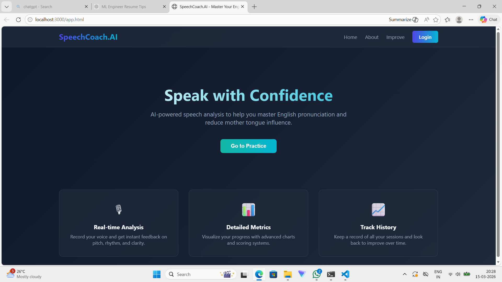
</div>

<br>

### User Authentication
<div align="center">
<table>
<tr>
<td width="50%">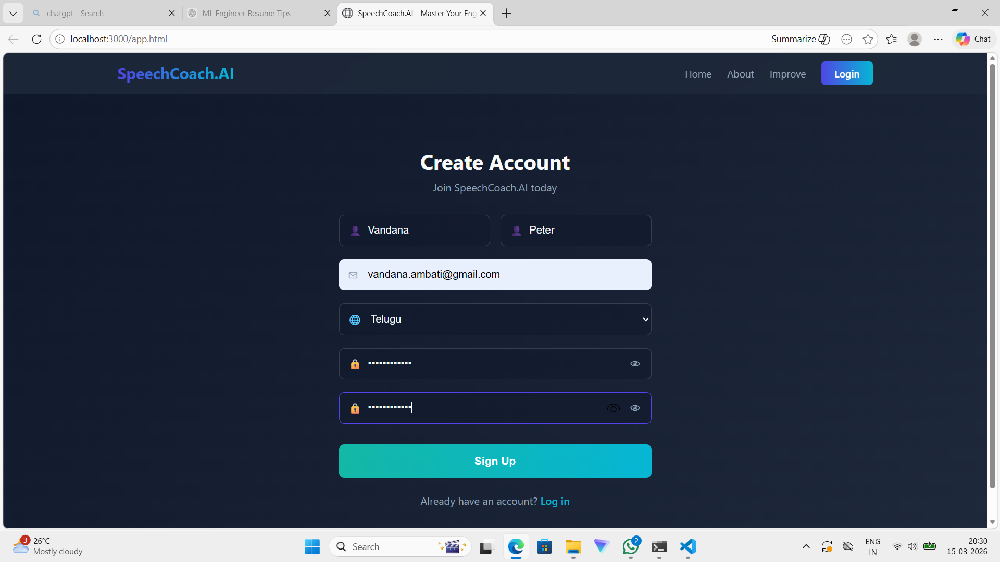</td>
<td width="50%">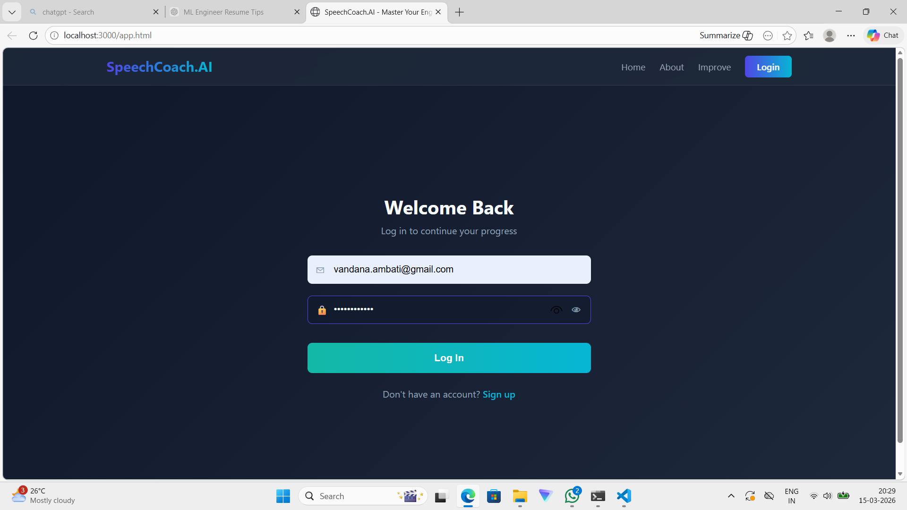</td>
</tr>
<tr>
<td align="center"><em>Create Account with native language selection</em></td>
<td align="center"><em>Secure login</em></td>
</tr>
</table>
</div>

<br>

### Choose Practice Mode
<div align="center">
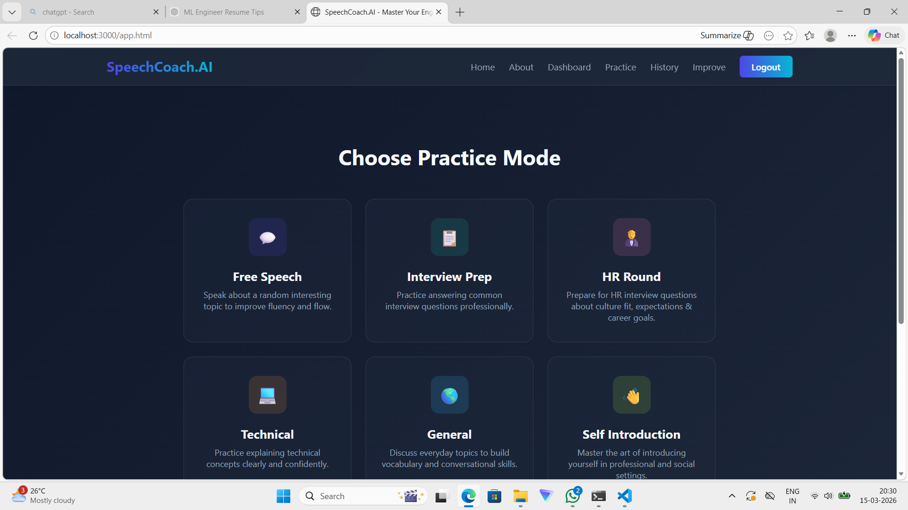
<p><em>6 practice modes: Free Speech, Interview Prep, HR Round, Technical, General, Self Introduction</em></p>
</div>

<br>

### Recording Flow
<div align="center">
<table>
<tr>
<td width="33%">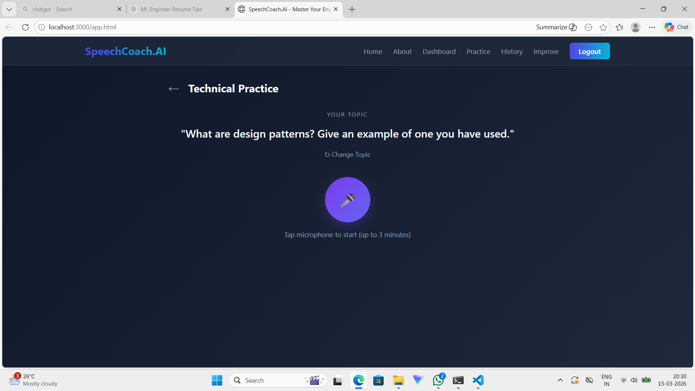</td>
<td width="33%">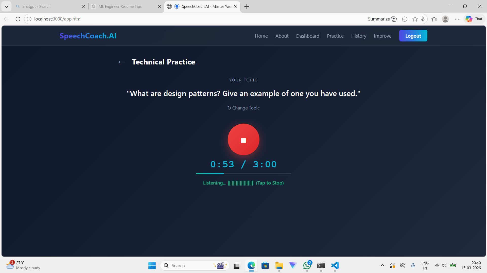</td>
<td width="33%">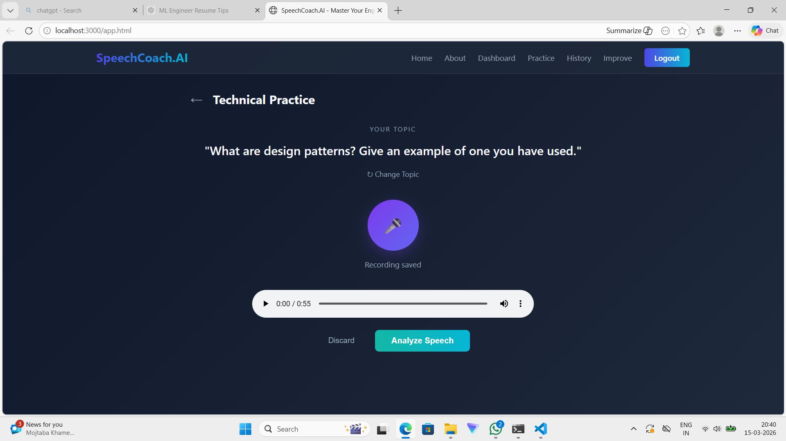</td>
</tr>
<tr>
<td align="center"><em>AI-generated topic prompt</em></td>
<td align="center"><em>Live recording with timer</em></td>
<td align="center"><em>Review & analyze</em></td>
</tr>
</table>
</div>

<br>

### AI Analysis in Action
<div align="center">
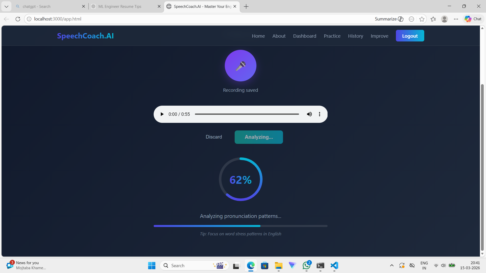
<p><em>Real-time analysis with progress indicator</em></p>
</div>

<br>

### Results & Feedback
<div align="center">
<table>
<tr>
<td width="50%">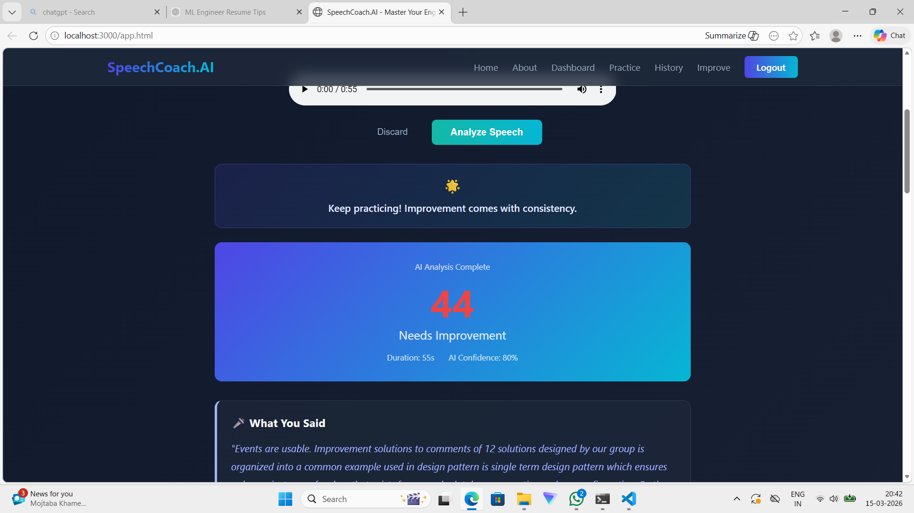</td>
<td width="50%">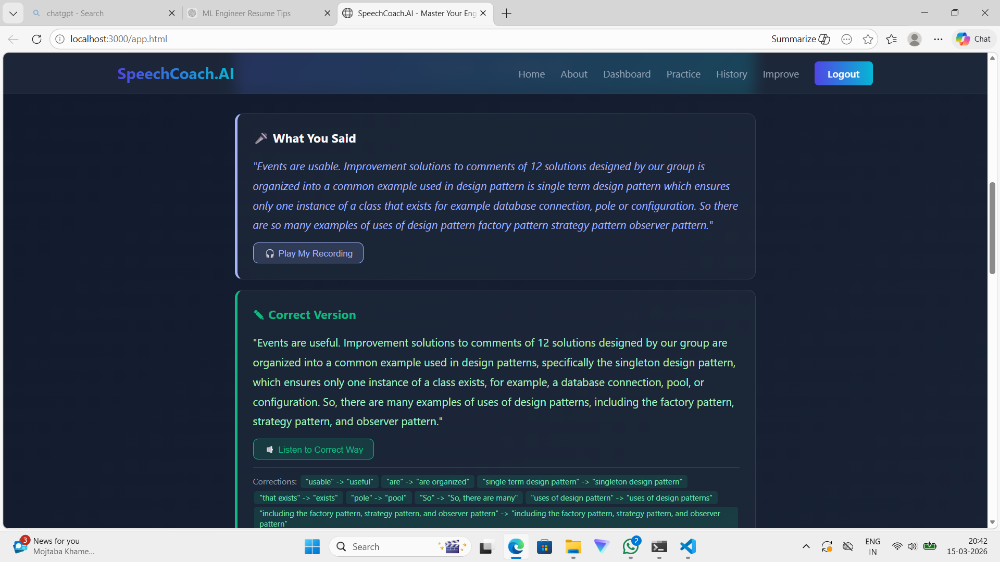</td>
</tr>
<tr>
<td align="center"><em>Overall score with transcription</em></td>
<td align="center"><em>"What You Said" vs "Correct Version" with word-level corrections</em></td>
</tr>
</table>
</div>

<br>

<div align="center">
<table>
<tr>
<td width="50%">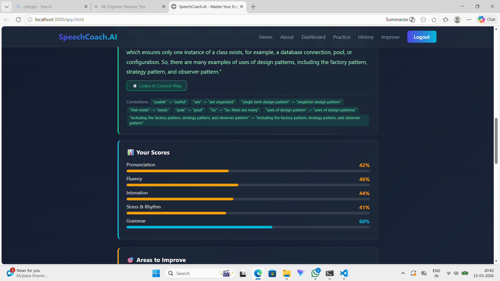</td>
<td width="50%">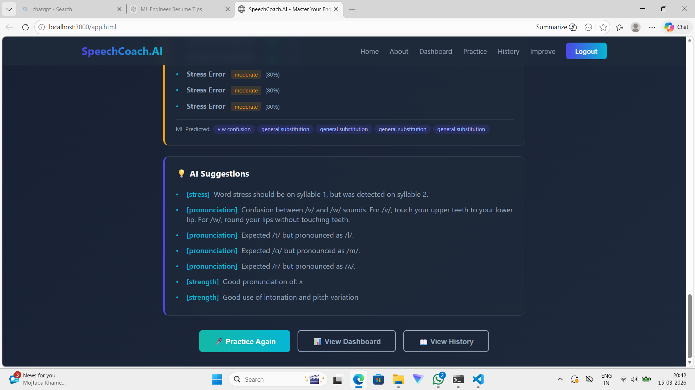</td>
</tr>
<tr>
<td align="center"><em>Detailed score breakdown: Pronunciation, Fluency, Intonation, Stress & Rhythm, Grammar</em></td>
<td align="center"><em>AI-powered suggestions with specific phoneme corrections</em></td>
</tr>
</table>
</div>

<br>

### Practice History
<div align="center">
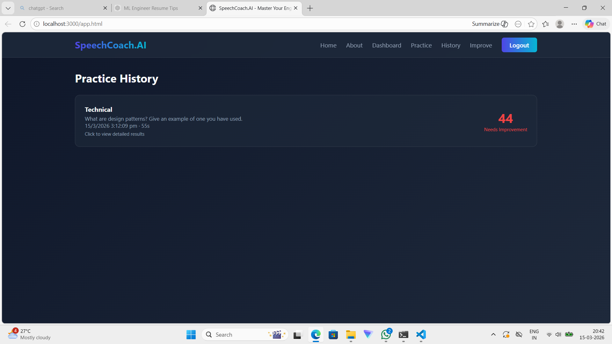
<p><em>Track all past sessions with scores and improvement status</em></p>
</div>

---

## System Architecture

<div align="center">


</div>

---

## Key Capabilities

| Capability | What It Does |
|------------|-------------|
| **Speech-to-Text** | Transcribes spoken English using OpenAI Whisper |
| **Phoneme-Level Analysis** | Scores every phoneme against expected pronunciation using Wav2Vec2 |
| **Prosody Evaluation** | Analyzes pitch contour, rhythm, stress patterns, and intonation |
| **Mother Tongue Detection** | Identifies error patterns specific to the speaker's native language |
| **GOP Scoring** | Computes Goodness of Pronunciation score per phoneme |
| **DNN Composite Scoring** | Neural network model combining pronunciation + fluency metrics |
| **Corrective TTS Audio** | Generates native-like audio examples for mispronounced words |
| **Progress Tracking** | Longitudinal analytics with improvement trends and learning paths |
| **Practice Modes** | Free Speech and Interview Preparation with guided prompts |

---

## Supported Native Languages

The system detects and corrects pronunciation patterns for **7 language backgrounds**:

| Native Language | Patterns Detected |
|----------------|-------------------|
| **Hindi** | TH sound substitution, V/W confusion, syllable-timed rhythm |
| **Tamil** | TH substitution, F sound replacement, retroflex consonant influence |
| **Bengali** | TH substitution, V/W confusion, vowel distortions |
| **Chinese (Mandarin)** | TH substitution, R/L confusion, tonal interference |
| **Spanish** | TH substitution, B/V merger, weak vowel reduction |
| **Japanese** | R/L confusion, vowel insertion, mora-timed rhythm |
| **Arabic** | P sound substitution, V sound absence, emphatic sound transfer |

New language profiles can be added without retraining any models.

---

## Analysis Pipeline

```
  User speaks          Whisper           Wav2Vec2          Parselmouth
  into browser         (STT)            (Phonemes)         (Prosody)
 +------------+    +-----------+    +--------------+    +-------------+
 |   Audio    | -> | Transcri- | -> |   Phoneme    | -> |   Pitch,    |
 |   Input    |    |   ption   |    |  Extraction  |    | Rhythm, F0  |
 +------------+    +-----------+    +--------------+    +-------------+
                                           |                   |
                                           v                   v
                                    +--------------+    +-------------+
                                    |  GOP + DNN   | <- |    MTI      |
                                    |   Scoring    |    |  Detection  |
                                    +--------------+    +-------------+
                                           |
                                           v
                                    +--------------+    +-------------+
                                    |  Feedback +  | -> | TTS Audio   |
                                    |  Tips        |    | Examples    |
                                    +--------------+    +-------------+
                                           |
                                           v
                                    +--------------+
                                    |  Progress    |
                                    |  Dashboard   |
                                    +--------------+
```

---

## Results

### Sample Feedback Report

After analyzing a speech sample from a Hindi-native speaker:

```
=============================================
       SPEECH COACH FEEDBACK REPORT
=============================================

  OVERALL SCORE: 75 / 100
    Pronunciation :  80%
    Prosody       :  65%
    Improvement   :  +5% from last session

  STRENGTHS
   - Accurate pronunciation of: w, r, l
   - Well pronounced words: water, world, really
   - Appropriate speaking pace

  AREAS TO IMPROVE

   [HIGH PRIORITY] "TH" Sound (/th/)
      Detected: pronounced as /t/ (common Hindi MTI pattern)
      Affected words: think, three, through
      Tip: Place tongue tip between upper and lower teeth,
           blow air gently without voicing.

   [MEDIUM] Vowel Length in "bit" vs "beat"
      Detected: short/long vowel not distinguished
      Affected words: sit/seat, bit/beat
      Tip: Hold the vowel longer for "ee" sounds.

  PRACTICE SENTENCES
   1. "The weather is getting better this Thursday."
   2. "I think three thousand is the right number."
   3. "They thought it was the best thing to do."

  CORRECTIVE AUDIO: 3 TTS samples generated for
  mispronounced words (playable in dashboard)

=============================================
```

### Scoring Metrics

| Metric | Description | Range |
|--------|-------------|-------|
| **Overall Score** | Weighted composite of all dimensions | 0 -- 100 |
| **Pronunciation Score** | Phoneme-level accuracy (GOP-based) | 0 -- 100% |
| **Fluency Score** | Speech rate, pause patterns, hesitations | 0 -- 100% |
| **Prosody Score** | Pitch, rhythm, stress appropriateness | 0 -- 100% |
| **MTI Severity** | How strongly native language patterns appear | Low / Medium / High |
| **Improvement Delta** | Score change compared to previous session | +/- % |

### Progress Tracking

The dashboard tracks learner progress over time:

- **Session history** with per-session scores and identified issues
- **Score trend charts** showing improvement across pronunciation, fluency, and prosody
- **Phoneme heatmaps** highlighting which sounds are improving vs. stuck
- **Learning path recommendations** adapting to the learner's specific weaknesses
- **Achievement milestones** for consistent practice and score improvements

---

## Tech Stack

<div align="center">

| Layer | Technologies |
|-------|-------------|
| **Speech Recognition** | OpenAI Whisper |
| **Phoneme Recognition** | Wav2Vec2 (HuggingFace Transformers) |
| **Prosody Analysis** | Praat via Parselmouth |
| **Grapheme-to-Phoneme** | g2p-en with CMU Pronouncing Dictionary |
| **ML Framework** | PyTorch, scikit-learn |
| **Text-to-Speech** | Coqui TTS (Tacotron2 + HiFi-GAN) |
| **Backend API** | FastAPI, JWT Authentication |
| **Frontend** | HTML5, CSS3, JavaScript, Web Audio API |
| **Database** | SQLite |
| **Audio Processing** | Librosa, SoundFile, noisereduce |

</div>

---

## What I Built

- A **complete end-to-end pipeline** from raw audio input to personalized pronunciation feedback
- **Phoneme-level scoring** using Goodness of Pronunciation (GOP) algorithm and a custom DNN composite scorer
- A **rule-based MTI detection engine** with profiles for 7 language backgrounds, extensible without model retraining
- **Real-time prosody analysis** extracting pitch contours, rhythm metrics, and stress patterns using Praat algorithms
- A **corrective TTS system** that generates native-like audio examples for mispronounced words
- A **full-stack web application** with user authentication, recording interface, analysis dashboard, and progress tracking
- A **RESTful API** with Swagger documentation for all analysis and tracking endpoints

---

## Acknowledgments

- [OpenAI Whisper](https://github.com/openai/whisper) -- Speech recognition
- [Wav2Vec2](https://huggingface.co/facebook/wav2vec2-xlsr-53-espeak-cv-ft) -- Phoneme recognition
- [Parselmouth](https://github.com/YannickJadoul/Parselmouth) -- Praat in Python
- [Coqui TTS](https://github.com/coqui-ai/TTS) -- Text-to-speech synthesis
- [g2p-en](https://github.com/Kyubyong/g2p) -- Grapheme-to-phoneme conversion

---

<div align="center">

**Built for language learners worldwide.**

</div>
